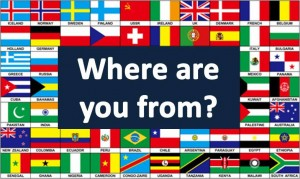

# WAYF

2019 AIU Summer DevCamp Project

## Introduce

## Project

WAYF means "Where Are You From?". 
This project purposes to guessing the country when person's pictures are given.
Our Deep-learning model will be studied by using FIFA players' data from Kaggle (https://www.kaggle.com/karangadiya/fifa19)
Please enjoy this project for fun

## Team

  * [Sungmin So](https://github.com/SungminSo)
